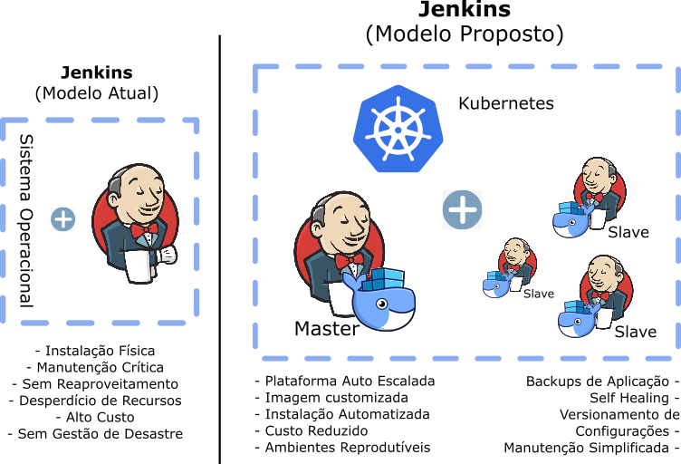

# Introdução e Conceitos

* [x]  **DevOps**  
São **práticas** utilizadas para melhorar a integração entre equipes de tecnologia.  
DevOps são simplesmente **conceitos**. DevOps não é, nem trata de ferramentas diretamente.  
  
* [x]  **Integração Contínua**  
É um dos conceitos contidos dentro da disciplina de DevOps que viabiliza o feedback rápido aos times envolvidos (fail-fast). Conhecida como *Continous Integration (CI)*, assim como o DevOps, também não é uma ferramenta, e sim conceitos.   
     
* [x]  **Jenkins**  
Atualmente a ferramenta mais utilizada para viabilizar os processos de integração contínua. Podemos assumir o Jenkins como o orquestrador do processo de CI, responsável por obter os códigos-fonte, avaliar, compilar, testar e prover um feedback aos interessados.  

* [x]  **Docker**  
Plataforma de Containers, com ela iremos construir uma imagem personalizada de Jenkins. Esta imagem, por sua vez, nos irá garantir reprodutibilidade, escala e rápida resposta a desastres.  

* [x]  **Kubernetes**  
Orquestrador de Containers, gerencia todo o processo de instalação e execução de containers, ele será responsável por gerir a execução da nossa imagem Jenkins e também prover recursos para a construção dos nossos códigos.

# Cenário: Crítico, com recursos limitados  

Vamos começar com a seguinte situação: temos uma instância de Jenkins (Master), que possui 500 jobs.  
Todos seus processos de construção dependem desta instância.  
  
1. Um Jenkins 'comum' normalmente costuma ter cerca de 100 plugins instalados. Atualizá-los de uma maneira geral é uma tarefa tranquila e executada de uma só vez.  
Feito isso, o Jenkins sofre um restart e passa a operar com os novos plugins.  
Ao longo das próximas horas alguns jobs vão parando de funcionar, e seu precisar retornar todos esses plugins a suas versões anteriores? No fim... está aberta a temporada de caça as bruxas!!! **Problema 1: Atualização E Rollback Seguro de Componentes**  

2. O server pegou fogo? Trágico, não? O último backup é do mês passado? O que você faria numa situação de desastre? **Problema 2: Automação de Backups e Recuperação de Desastres**  

3. Nosso server atualmente é uma máquina com 4 núcleos e 16GB de RAM e nos custa USD $272 / mês:
  
Num formato auto escalado o nosso Jenkins (Master) seria uma máquina menor, pois as construções seriam feitas com recursos externos (Slaves), todas essas máquinas nos custariam algo em torno de USD $45 / mês
  
Logo temos nosso **Problema 3: Jogar dinheiro no lixo**  

# Arquitetura Proposta  

  
OK! É hora de colocar a mão na massa!  
  
  
