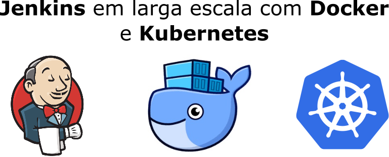

   

Material referente ao Curso [Jenkins em Larga Escala](https://www.udemy.com/missao-devops-jenkins-em-larga-escala-docker-e-kubernetes/?couponCode=LANCAMENTO).   

## Tópicos
Seção 1: [Introdução](01-Intro)  
Seção 2: [Jenkins & Docker](02-Jenkins-e-Docker)  
Seção 3: [Jenkins AutoConfig via Groovy](03-Jenkins-AutoConfig-Groovy)  
Seção 4: [Jenkins & Kubernetes](04-Jenkins-e-Kubernetes)  
  
Extra: [VMs com Vagrant e Ansible](https://gitlab.com/rocha.public/vm-host-archetype)  
Extra: [Play With K8s](05-Extras-Play-With-K8s) 
   

  